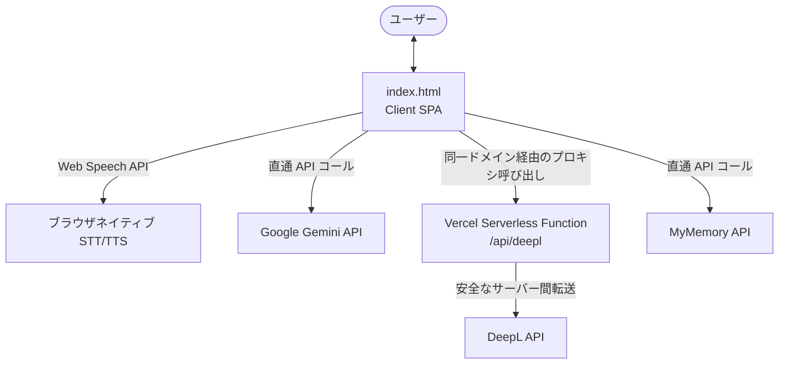

# 🏗️ 同時多言語翻訳アプリ - アーキテクチャ設計書

このドキュメントでは、本アプリケーションの技術スタック、ディレクトリ構造、データフロー、および設計上の主要な機能モジュールについて解説します。

---

## 1. 全体アーキテクチャ概要

本アプリは、クライアントサイド主導の **シングルページアプリケーション (SPA)** と、外部API制約をバイパスするための **サーバーレス・プロキシバックエンド** のハイブリッド構成を採用しています。



### 技術スタック
- **フロントエンド**: HTML5, Vanilla CSS (CSSカスタムプロパティを活用したモダンスタイル), Vanilla JavaScript (ES6+)
- **バックエンド**: Node.js 20 (Vercel Serverless Functions)
- **インフラ**: Vercel (ホスティング、APIルーティング、自動SSL)

---

## 2. ディレクトリ構造

プロジェクトは極限まで無駄を削ぎ落とした軽量なフォルダ構成となっています。

```text
05_Trilingual_traslator/
├── api/
│   └── deepl.js        # DeepL API通信用のVercelサーバーレス関数 (Node.js)
├── index.html          # アプリケーション本体 (フロントエンドUIとJSロジックを一括内包)
├── vercel.json         # キャッシュ制御およびVercelのプロジェクト設定
└── README.md           # ユーザーガイド (取扱説明書)
```

---

## 3. 主要モジュールと設計の特徴

### ① Vercelサーバーレス関数によるCORS・プリフライト回避 (`api/deepl.js`)
- **背景**: ブラウザから直接DeepLのAPIキーを使ってリクエストを投げると、`Authorization` ヘッダーのようなカスタムヘッダーの存在により、ブラウザが **CORSプリフライト（OPTIONS）リクエスト** を送信します。多くの公開CORSプロキシやDeepL API本体はこのOPTIONSリクエストのブラウザ側処理でエラー（`Failed to fetch`）を引き起こします。また、無料公開プロキシ（`corsproxy.io`等）はセキュリティの観点から本番ドメインでの利用制限（HTTP 403）があります。
- **解決策**: Vercel上で動く中継API `/api/deepl` を自前で実装しました。
  - フロントエンドは同一ドメインの `/api/deepl` に対して標準ヘッダーでリクエストを送るため、CORSエラーやブラウザのネットワーク制限を一切受けません。
  - サーバーサイドのNode.js環境でヘッダーを再構成し、安全にDeepLの公式エンドポイント（`api.deepl.com` または `api-free.deepl.com`）に転送します。

### ② クライアントサイドでの強固なAPIキー・クレンジング
- **背景**: ユーザーがAPIキーを設定する際、全角スペース、改行コード、不要なタブ文字などがコピー＆ペーストで混入しやすく、これがリクエストヘッダーに含まれると `String contains non ISO-8859-1 code point` というブラウザ例外を発生させてクラッシュします。
- **解決策**: JavaScript側にキー専用のサニタイズ関数を実装しました。
  ```javascript
  function sanitizeKey(key) {
      return (key || '').replace(/[^\x21-\x7E]/g, ''); // ASCII 33(!) から 126(~) までの半角英数記号のみを抽出
  }
  ```
  - アプリ起動時（ローカルストレージからの読み込み時）と、入力フィールドへのタイプ/ペースト時の双方でこの関数を通すことで、不正文字がAPI通信に混入するのを100%防ぎます。

### ③ キャッシュバスターと最適化 (`vercel.json`)
- フロントエンドの更新がブラウザキャッシュによって阻害され、古いバージョン（`v1.7.2`など）が残り続けるのを防ぐため、`vercel.json` にて以下のヘッダーを強制適用しています。
  ```json
  "headers": [
    {
      "source": "/(.*)",
      "headers": [
        { "key": "Cache-Control", "value": "no-cache, no-store, must-revalidate" }
      ]
    }
  ]
  ```
  これにより、HTMLファイルへのリクエストは常にキャッシュを通さずサーバーに最新版を確認しに行きます。

### ④ 動的なGeminiモデル検知とページネーション
- Geminiエンジンの安定性を担保するため、特定のモデル名をハードコードせず、APIキー入力時に Google の `models` リストAPI（`v1beta` および `v1`）へ自動で問い合わせます。
- APIから返されるページネーション（`nextPageToken`）に完全対応し、翻訳に対応していない不要なモデル（Liveモデル、Audioモデル、ロボティクスモデルなど）を除外フィルタリングした上で、最適な翻訳モデルをリストアップします。

### ⑤ 現地表現アドバイザー (Local Expression Advisor) の表示制御
- **ロジック**: `transEngine === 'gemini' && isGeminiConnected`（Geminiエンジンが選択され、かつ疎通テストが緑色の状態）の時のみ、モーダル内の「現地表現アドバイザー」セクションをアクティブ（`display: block`）にします。
- **処理**: 入力テキストをベースに、選択された国（台湾、米国、韓国など）に最も適した現地スラングや口語表現にリライトするプロンプトを組み立て、Geminiの `generateContent` をコールします。

---

## 4. データフロー (同時翻訳処理)

1. **入力受付**: ユーザーがテキストを入力、または音声入力（STT）を実行。
2. **言語判定と状態変更**: 入力されたカードをソース（ベース言語）としてマーク。CSSクラス `.translation-source` が付与され、左側に綺麗な緑色のアウターグロウが表示されます。
3. **翻訳処理の分岐**:
   - **Gemini**: 1回のリクエストで複数言語を同時にJSON形式で出力させるプロンプトを送信。
   - **DeepL**: 非同期でそれぞれの言語カードに対して、同一ドメインの `/api/deepl` 経由で個別リクエストを並列実行。
   - **MyMemory**: パブリックAPIに対して直接並列リクエストを実行。
4. **UI反映**: 各言語カードへ翻訳結果を展開し、音声合成（TTS）での再生準備を整えます。
